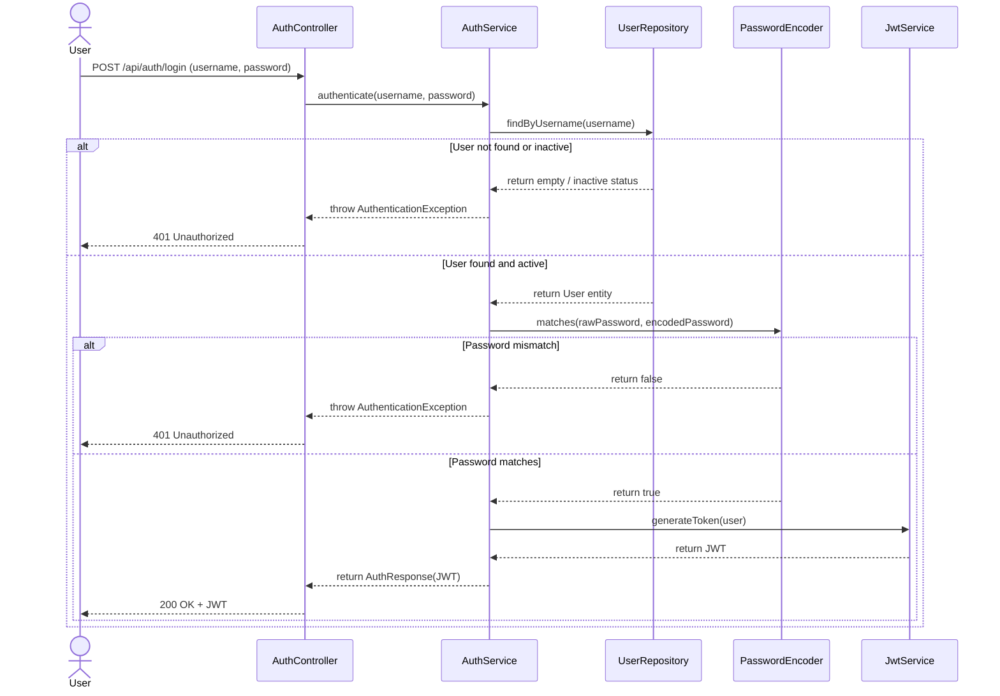
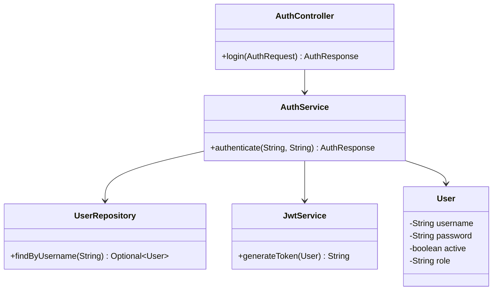
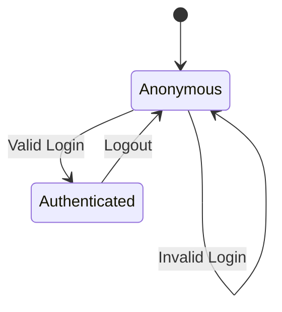

# Solution Diagrams — RF-01

This document details the diagrams of the proposed solution to understand the implementation.

---

## 1. Sequence Diagram (Mandatory)

Shows the sequence flow of the solution being specified, illustrating the interaction between actors, controllers, services, repositories, and external systems.

---

## 2. Class Diagram (Mandatory)

Shows the classes, interfaces, attributes, and methods involved in the solution and their relationships.

---

## 3. Additional Useful Diagram (Optional / Space for other diagram)

