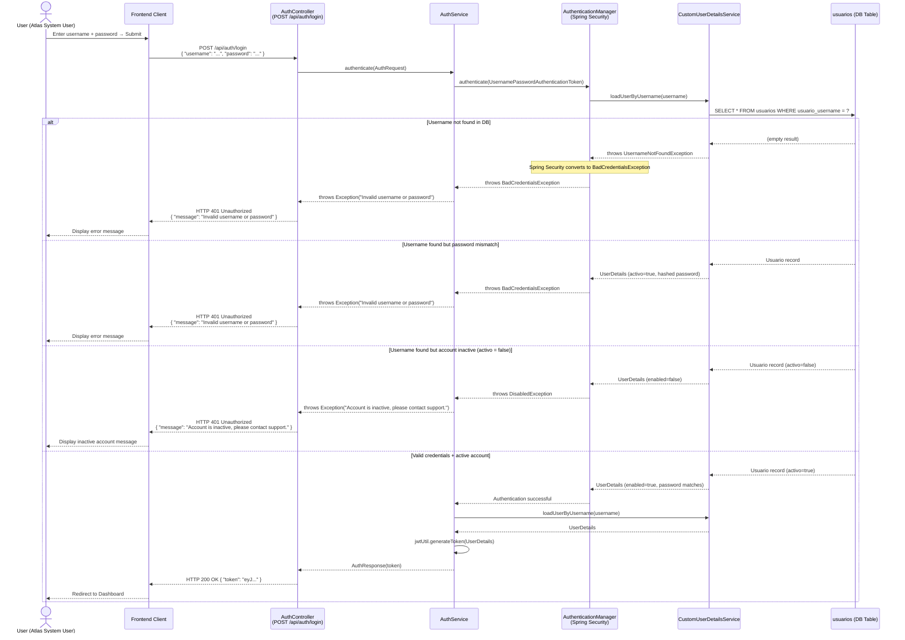
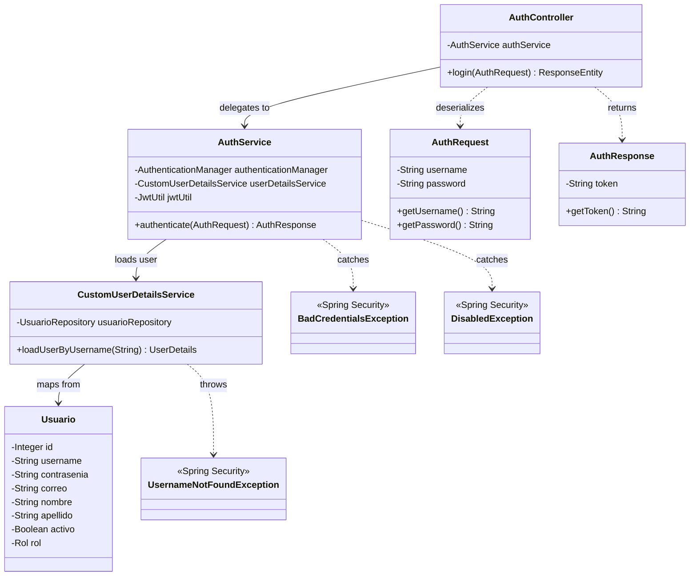
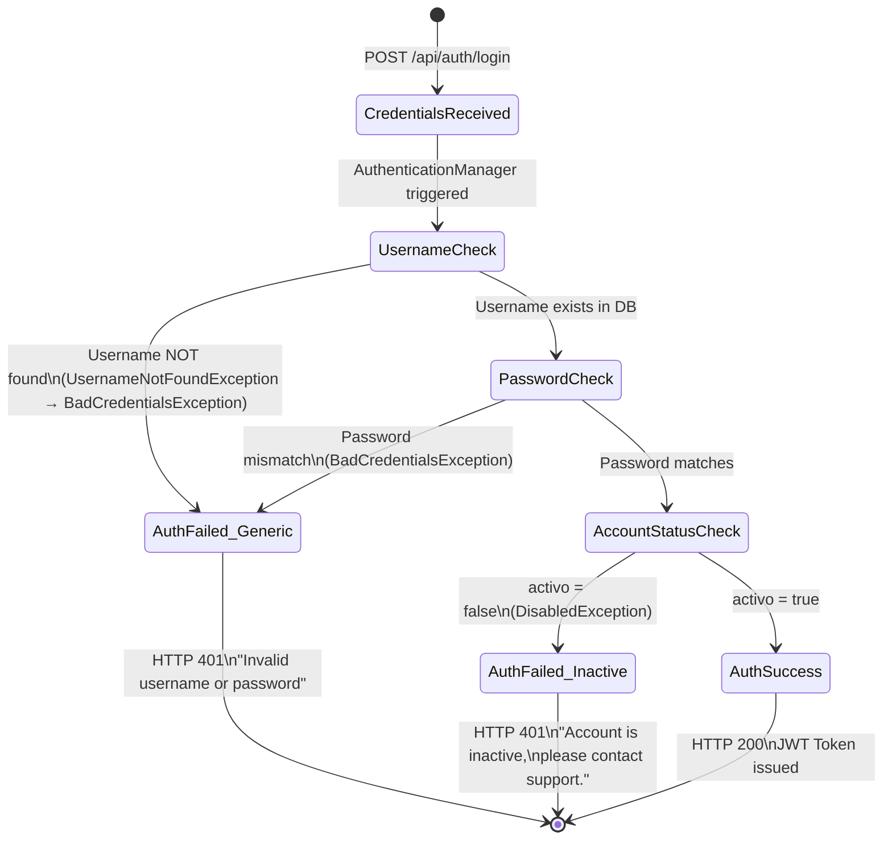

# Solution Diagrams — RF-02

This document details the diagrams of the proposed solution to understand the implementation.

---

## 1. Sequence Diagram

Shows the full authentication failure flow through the Atlas backend, from the HTTP request to the error response reaching the client.

---

## 2. Class Diagram

Shows the classes, interfaces, and relationships involved in the authentication failure handling.

---

## 3. Error Response State Diagram

Shows the possible states an authentication attempt can transition through, and which error message is emitted at each failure state.

