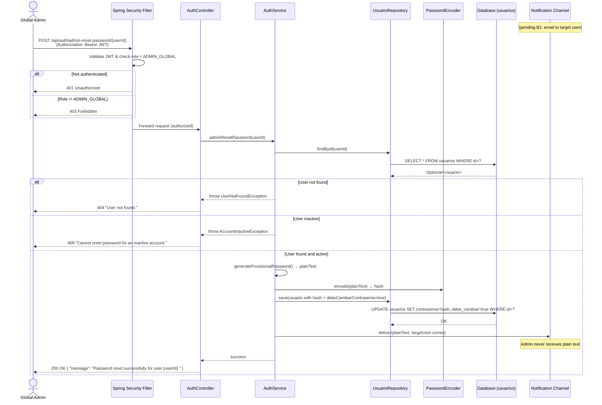
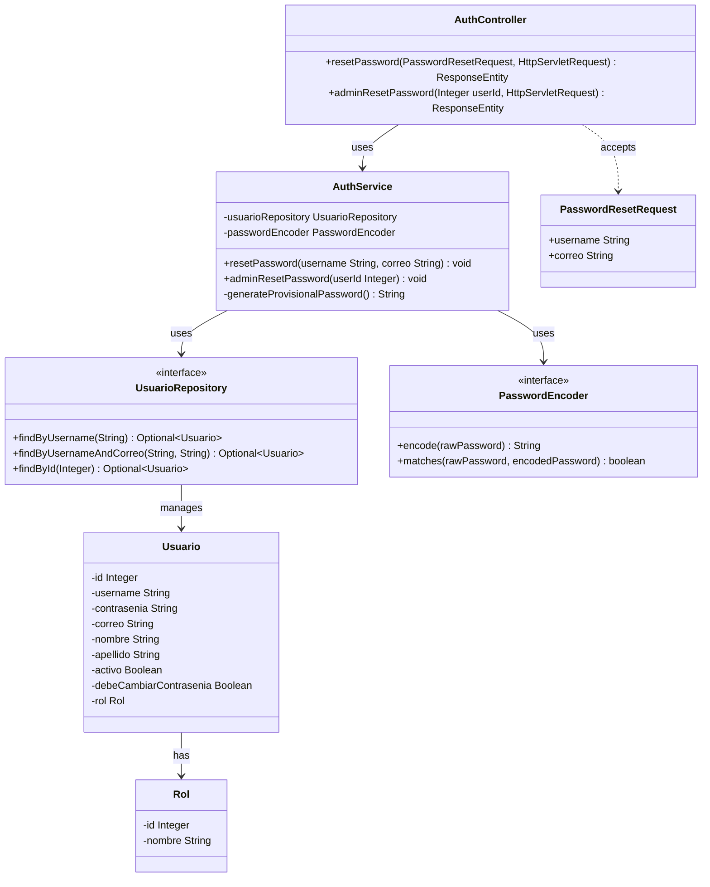
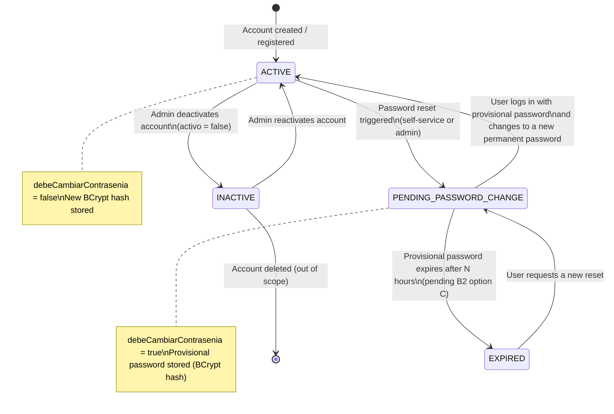

# Solution Diagrams — RF-03

This document details the diagrams of the proposed solution to understand the implementation.

---

## 1. Sequence Diagram — Self-Service Password Reset (spec-01)

Shows the flow for a user who requests a new provisional password by providing their username and email.

```mermaid
sequenceDiagram
    actor User as User
    participant AC as AuthController
    participant AS as AuthService
    participant UR as UsuarioRepository
    participant PE as PasswordEncoder
    participant DB as Database (usuarios)
    participant NOTIF as Notification Channel
    note over NOTIF: (pending B1: email / on-screen)

    User->>AC: POST /api/auth/reset-password<br/>{ username, correo }
    AC->>AC: Validate fields (not blank)
    alt Missing fields
        AC-->>User: 400 Bad Request
    end

    AC->>AS: resetPassword(username, correo)
    AS->>UR: findByUsernameAndCorreo(username, correo)
    UR->>DB: SELECT * FROM usuarios WHERE username=? AND correo=?
    DB-->>UR: Optional<Usuario>

    alt User not found or email mismatch
        AS-->>AC: throw UserNotFoundException
        AC-->>User: 404 "No account found matching the provided credentials."
    else User found but activo = false
        AS-->>AC: throw AccountInactiveException
        AC-->>User: 403 "Account is inactive, please contact support."
    else User found and active
        AS->>AS: generateProvisionalPassword() → plainText
        AS->>PE: encode(plainText) → hash
        AS->>UR: save(usuario with hash + debeCambiarContrasenia=true)
        UR->>DB: UPDATE usuarios SET contrasenia=hash, debe_cambiar=true WHERE id=?
        DB-->>UR: OK
        AS->>NOTIF: deliver(plainText, user.correo)
        note over NOTIF: Delivery pending B1 decision
        AS-->>AC: success
        AC-->>User: 200 OK { "message": "Provisional password issued." }
    end
```

---

## 2. Sequence Diagram — Admin-Driven Password Reset (spec-02)

Shows the flow for a Global Admin resetting another user's password from the management screen.

---

## 3. Class Diagram — Static Design

Shows the classes, interfaces, attributes, and methods involved in the solution.

---

## 4. State Diagram — User Account States During Reset Flow

Shows how a `Usuario` transitions between states through the password reset lifecycle.

