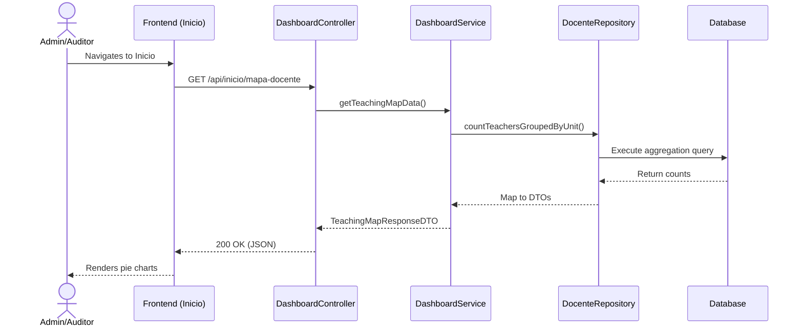
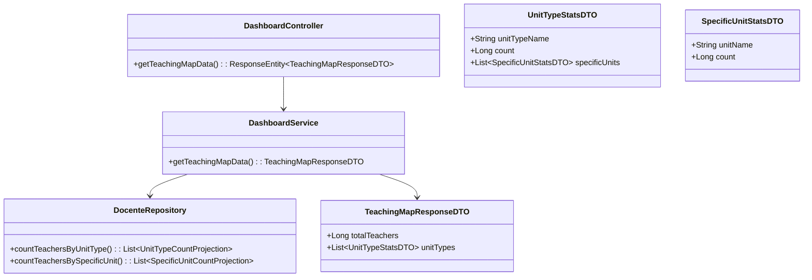

# Solution Diagrams - RF-04

## 1. Sequence Diagram

```mermaid
sequenceDiagram
    actor Admin as Admin/Auditor
    participant UI as Frontend (Inicio)
    participant Ctrl as DashboardController
    participant Svc as DashboardService
    participant Repo as DocenteRepository
    participant DB as Database

    Admin->>UI: Navigates to Inicio
    UI->>Ctrl: GET /api/inicio/mapa-docente
    Ctrl->>Svc: getTeachingMapData()
    Svc->>Repo: countTeachersGroupedByUnit()
    Repo->>DB: Execute aggregation query
    DB-->>Repo: Return counts
    Repo-->>Svc: Map to DTOs
    Svc-->>Ctrl: TeachingMapResponseDTO
    Ctrl-->>UI: 200 OK (JSON)
    UI-->>Admin: Renders pie charts
```

## 2. Class Diagram

```mermaid
classDiagram
    class DashboardController {
        +getTeachingMapData(): ResponseEntity~TeachingMapResponseDTO~
    }

    class DashboardService {
        +getTeachingMapData(): TeachingMapResponseDTO
    }

    class DocenteRepository {
        +countTeachersByUnitType(): List~UnitTypeCountProjection~
        +countTeachersBySpecificUnit(): List~SpecificUnitCountProjection~
    }

    class TeachingMapResponseDTO {
        +Long totalTeachers
        +List~UnitTypeStatsDTO~ unitTypes
    }

    class UnitTypeStatsDTO {
        +String unitTypeName
        +Long count
        +List~SpecificUnitStatsDTO~ specificUnits
    }

    class SpecificUnitStatsDTO {
        +String unitName
        +Long count
    }

    DashboardController --> DashboardService
    DashboardService --> DocenteRepository
    DashboardService --> TeachingMapResponseDTO
```

## 3. Supporting Diagram (Data Flow)

(Placeholder for future expansion if complex filtering is added)
