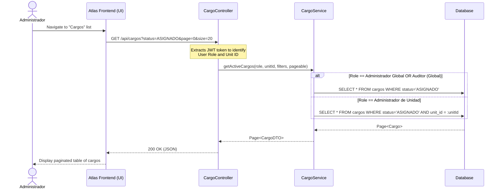
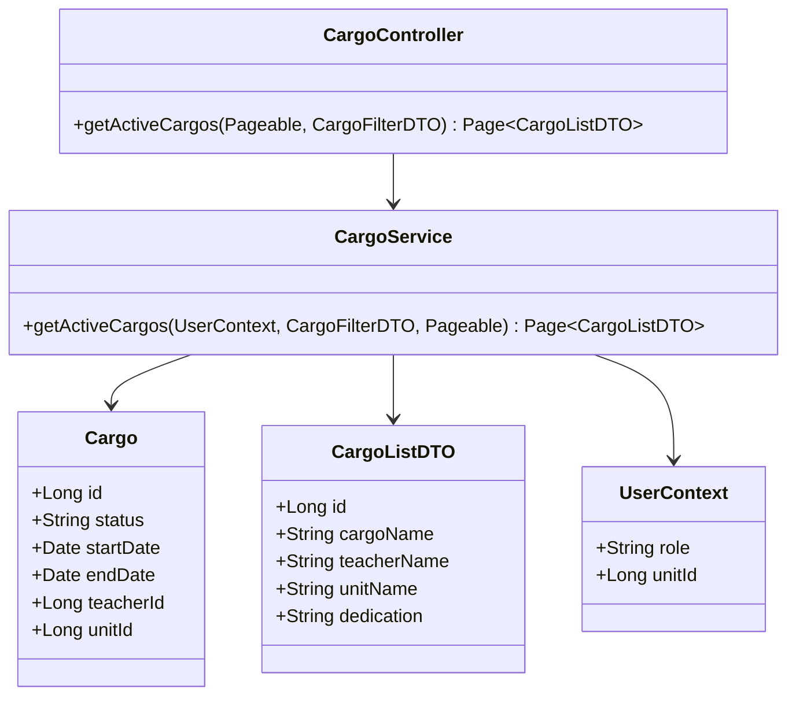

# Solution Diagrams - RF-06

## Sequence Diagram

This diagram shows the flow of fetching the active cargos list, highlighting how unit authorization is enforced.

## Class Diagram

This diagram models the key backend entities and DTOs involved in serving this list.

