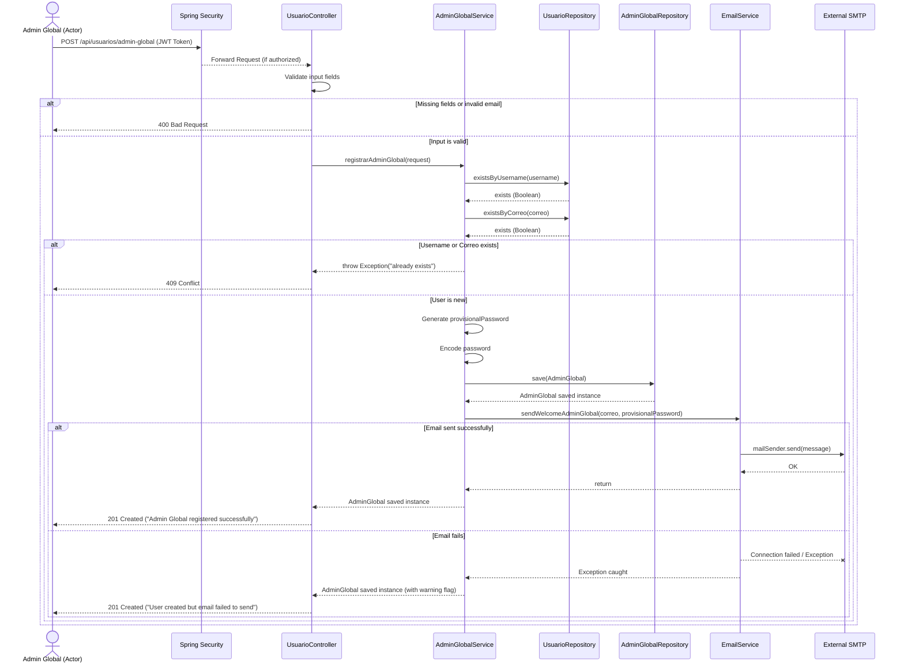
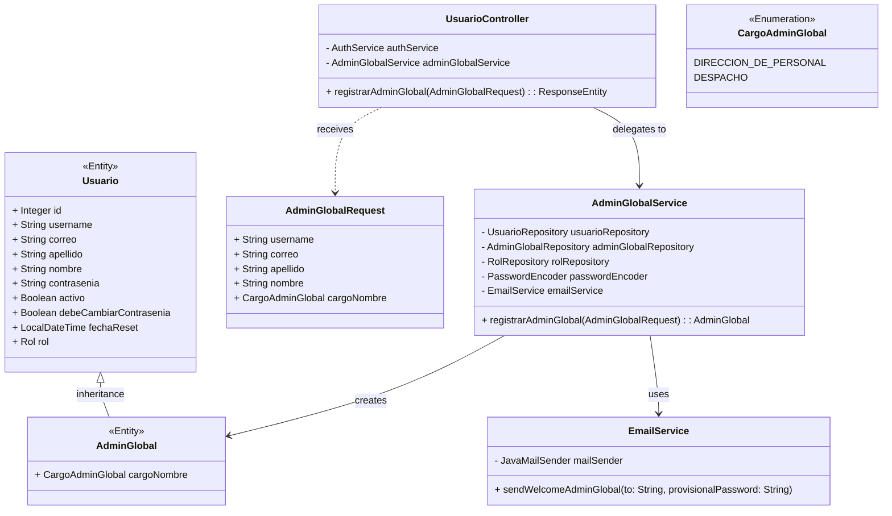

# Solution Diagrams — RF-27

## 1. Sequence Diagram
This diagram details the interaction flow between the actors and system components when registering a new Global Administrator.

---

## 2. Class Diagram
This diagram outlines the static structure and main classes involved in the solution.

---

## 3. Additional Diagrams
*(No additional diagrams are necessary for this specific flow at this time).*
