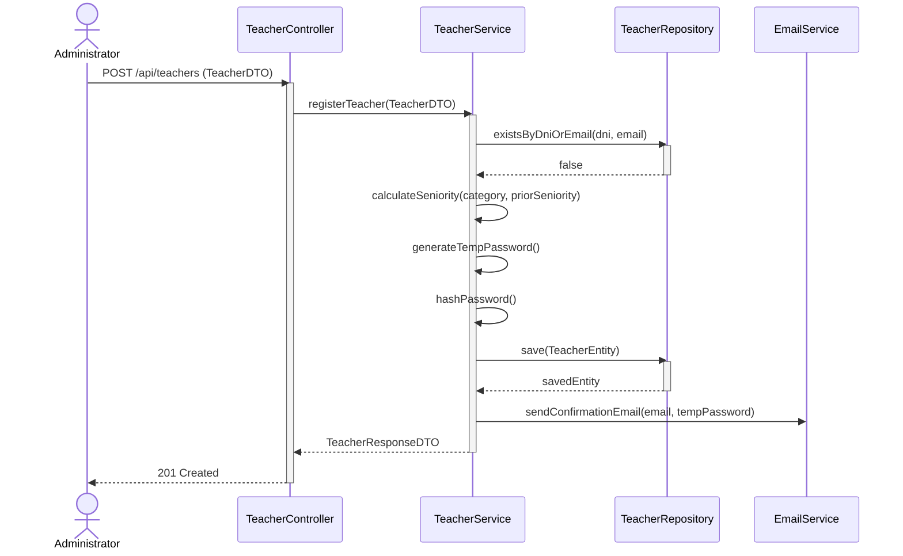
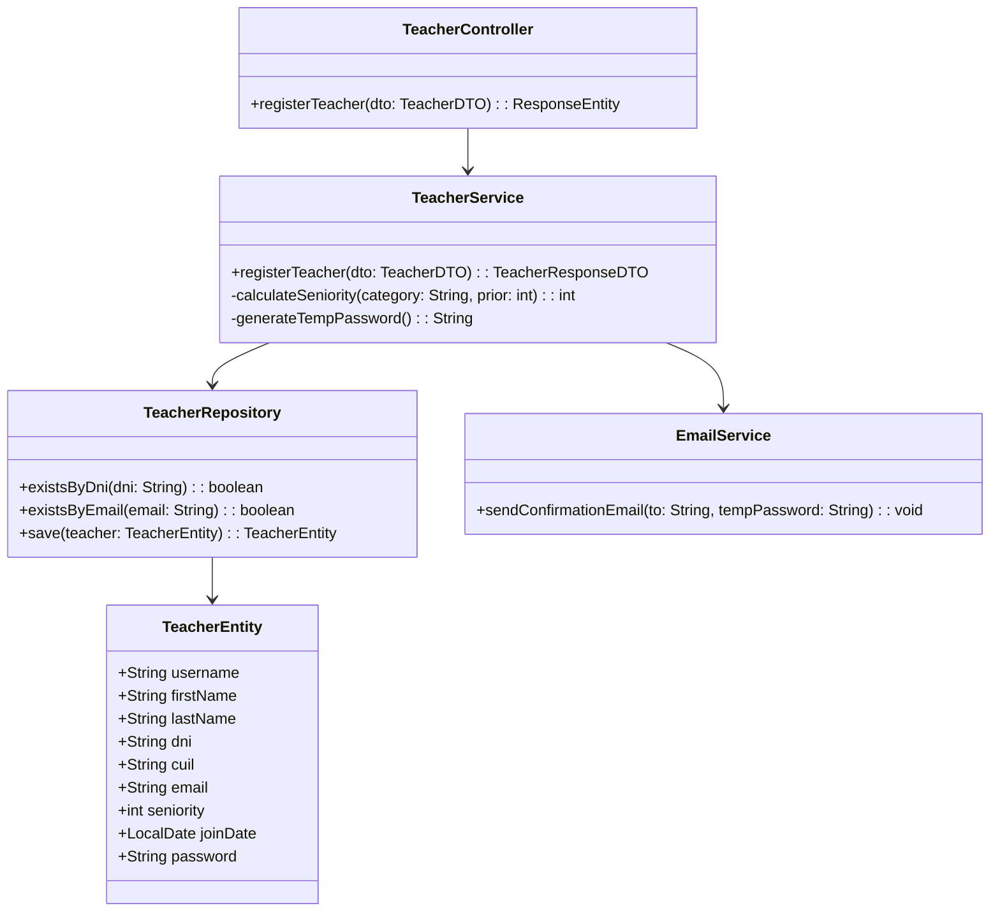

# Solution Diagrams - RF-30

## 1. Sequence Diagram
This diagram illustrates the interaction flow when an Administrator registers a new Teacher.

## 2. Class Diagram
This diagram outlines the core entities and services involved.

